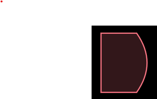

Solar System Generator
======================

This generator should help authors and world builder to create interesting but somewhat realistic star systems.

It is inspired by xxxxxx, yyyyy and zzzzz.

Different to the available generators, the SSG generates first a JSON-document representing the composition of the system.
This document can be changed manually to fit specific needs. Furthermore a json document can be provided prefilled with any number of objects, the SSG will then use this template to generate a system and will populate the missing attributes.

In a second step the generated file can be used to create a schematic visualization.

Central Body
------------

The generator can only create systems where planets orbit either a single star or the barycenter (common center of gravity) of binary system. 
These kind of P-Type (Circumbinary orbits) can be stable. Systems with more than 2 central bodies will not be stable.
S-Type (Circumstellar orbits) would technically still be a binary system, but the companion star is far away and both stars are not orbited together.

The central bodies will be selected from the following list. A realistic distribution would massivly favour red dwarf systems. 
To achieve a more variied (and interesting) output, the selection is strongly skewed to the more exotic astronomical bodies.

code ~ class ¬ color, mass ¬ diameter ¬ luminosity ¬ temp  ¬ real frequency ¬ used frequency
O ¬ Blue Giant Star ¬ #ff4455

In case of binary systems it is possible a star fills its roche lobe. In this case the star will exchange material with its neighbour via an accretion disk.

If both stars fill their respective roche lobes a contact binary will develop.

Depending on number and type of central bodies we calculate some limits:
- totalLuminosity, the sum of the maximum luminosity of all central bodies and their accretion disks.
- rocheLimit, further in celestial bodies will be ripped apart
- innerStableOrbit, in binary systems a plant has to be at least this far away not to be ejected from the system
- habitableZoneInnerLimit
- habitableZoneOuterLimit
- FrostLine
- HillSphere, the outer limit of the star system, beyond this imit planets will no longer by gravitationally bound to its system

Based on these limits we determine the size of the system: the inner border is the outmost of rocheLimit and innerStableOrbit.
The outer Border is given by the Hillsphere.

Between the two limits we will place a number of planets. Either the number of planets has been given via the editor, or the number will
be randomly generated. The number of planets is dependend on the following poisson distribution:

e.g. the minimum number of planets is 0 (obviously), the maximum is 99, however the peak will be around 20 Planets.

In the next step the planets are distributed within the available space. Planets are not uniformly distributed but follow again a poisson distribution where
most planets are located in the inner 1/3rd of the system:

For each placed orbit we first determine the type of body from the following distribution:
SINGLE_BODY
BINARY_BODY
ASTEROID_BELT

For each planetary body (single or binary)  we select a class: (terrestial, gas-giant, ice-giant, dwarf-planet) according to the given distribution.
For each body an albedo is selected from the albedo range. For planets with a surface the albedo range beyond the frost limit ha sdifferent values, 
this is due to the possibility of an highly reflective icy surface.
Furthermore mass and radius are randomly selected from the given ranges. Depending on these values the escape velocity is calculated.

Based on albedo, orbital distance and totalLuminosity we calculate a surface temperature (naked) for each body.

In the next step we determine the atmospheric composition (based on escape velocity and surface temperature) and calculate a average temperature based on athmospheric density.

Central Bodies
--------------

There can be a maximum of 2 central bodies.
They can be of type:

- black hole
- neutron star

- white dwarf
- red dwarf
- yellow sun
- red giant
- blue giant

each star has a associated luminosity, temperature and color.

If two stars are to close to each other they can exchange material via an accretion disk.

Extra Symbols for Wolf-Rayet-Stars or Cepheides.

For a single star the symbol can be 400px heigh.
For a double star each symbol will be 150px heigh.
For a double star the barycenter will be on the ecliptic.

Zones
-----

Zone or markers can be activated or deactivated. They are:
- roche limit, 
- ice limit, 
- ecliptic, 
- habitable zone, 
- graviational influence, 
- heliopause

- distance measure
- solar system for scale
- resonances

orbiting_bodies
---------------

Monday14?

All orbiting bodies are shown equidistance.

- Asteroid Belts

Shown as a density distribution
OR as a random sampling

Never to belts beside each other.

- Planetary-Systems

planetary-systems
-----------------

Double Planet (in this case the barycenter is on the ecliptic, both planets are above each other)
  
If tidally locked to the other plant: marked with a vertical bracket and Arrow.
If mutually locked: mark with a vertical double bracket.

Planet

- Axis (retrograde motion displayed by using a different axis-color and an rotation arrow)
- retrograde motion (small arrow below the planet)
- Tidal-Lock (Axis must be 0 deg),: show a day and a dark side
- Atmosphere (if not a Gas-Giant marked by a double-outline)
- local plane (usually 90deg to Axis, but can be different), marked by a line
- local roche limit
- orbital resonance: if a planets orbit s in resonance with one of its neighbours, horizontal bracket marker with the factor (e.g. 2:3)
                     if several planets are in resonance with each other: multi bracket

Above view:
- rings are shown circular
- moons are shown on the local plane

Side View:
- rings are shown as lines, moons are shown in a row

Scenic View:
- rings are tilted, moons are shown distributed

Moons
-----

Moons with atmosphere have double outline.
Moons in tidal lock show a marker towards the planet
Moons in resonance have a bracket marker

Moons around a double planet, don't exists, they are always partnered with one of them.

